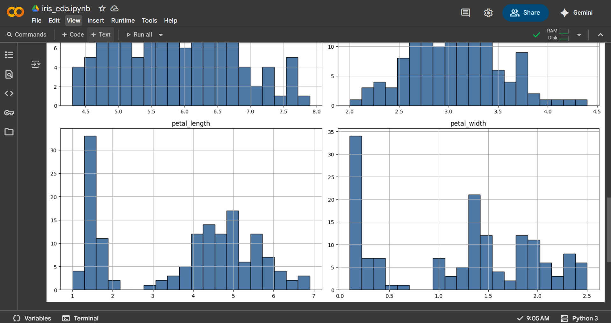

# Iris Dataset - Exploratory Data Analysis (EDA)

This project performs basic exploratory data analysis (EDA) on the Iris dataset using Python, Pandas, and Matplotlib in Google Colab. The goal is to understand the structure, distribution, and key statistics of the dataset features.

---

## Features Covered

- Load dataset using `pandas`
- View basic statistics: mean, median, standard deviation, `.describe()`
- Plot histograms of all numeric features using `matplotlib`

---

## Technologies Used

- Python
- Pandas
- Matplotlib
- Google Colab

---

## Open in Google Colab

---

## Dataset Source

[Dataset](https://bit.ly/4nejNue)  
(A shortened URL pointing to the Iris dataset in CSV format)

---

## Output Screenshot

